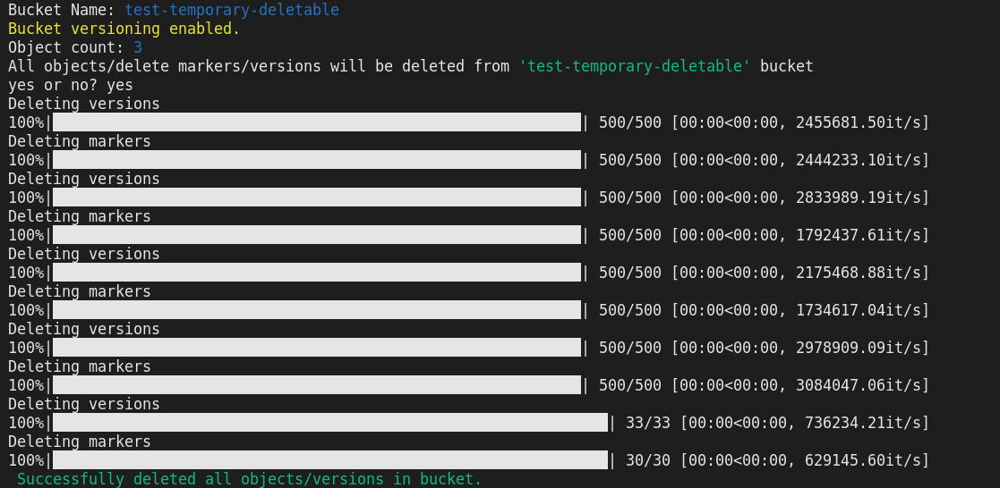

### Remove All Objects From S3 Bucket

This Python script attempts to delete the all objects/delete markers/versions from specific S3 bucket.

**Requirements:**

* Tested with:
   * Python version: 3.8.10
   * Boto3 version: 1.20.11
   * Argparse version: 1.4.0
   * Tqdm version: 4.62.3
* Valid AWS API keys/profile

Install necessary packages with following command

``` python3 -m pip install -r requirements.txt ```

**Usage:**

You could use ```python3 s3-cleaner.py -h``` command for help.

Example usage:

``` python3 s3-cleaner.py -p <aws_profile> -b <bucket_name> -r <region_name> ```


**Output:**




**Notices**

It's necessary to enable versioning if you want to delete all delete markers and versions for bucket.

